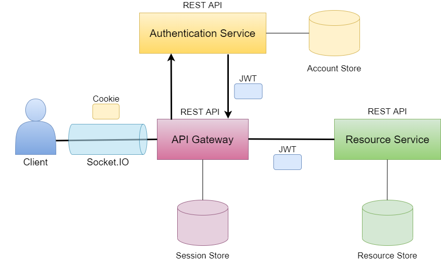

# Authentication Service

A microservice to handle authentication for the ChatBuds application.

## System overview
ChatBuds is built as a small microservice-architecture. The consumer/client only communicates with the API Gateway which handles the back-end communication.

The client: https://github.com/irosvall/chatbuds-client

The API Gateway: https://github.com/irosvall/chatbuds-api-gateway

The Resource Service: https://github.com/irosvall/chatbuds-resource-service



## API documentation
The documentation of which http requests are possible to make is found at: https://app.swaggerhub.com/apis-docs/chatbuds/auth-service/1.0.0

## Starting up this project locally
#### Enter "npm install" in the terminal to build the dependencies

To run the Authentication Service locally you will need to add a .env file to the root of the project.

The .env file should contain:

- PORT= which port the Authentication Service should run on
- DB_CONNECTION_STRING= the database connection string
- PRIVATE_KEY_FILEPATH= the file path to private RS256 key used for JWT encoding
- PUBLIC_KEY_FILEPATH= the file path to public RS256 key used for JWT decoding
- ACCESS_TOKEN_LIFE= specifies how long the JWT should be valid for in milliseconds

(replace the description next to "=" with its desired value)

### Generate RS256 key pairs

The JWTs issued by the service should use RS256 encryption. To achieve this, you need to generate private and public keys.

```bash
$ openssl genrsa -out private.pem 2048
Generating RSA private key, 2048 bit long modulus
.....+++++
...................................+++++
e is 65537 (0x010001)

$ openssl rsa -in private.pem -pubout -out public.pem
writing RSA key

```

## Running Authentication Service
Development mode: enter "npm run start:dev" in the terminal.

Production mode: enter "npm start" in the terminal.

## Linting the code
Check for linting problems by entering "npm run lint" in the terminal.

Fix linting problems automatically by entering "npm run lint:fix" in the terminal.
